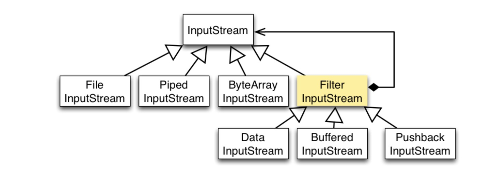

### JAVA IO
Java的I/O可以分成以下几类
- 磁盘操作 File
- 字节操作 InputStream和OutputStream
- 字符操作 Reader和Writer
- 对象操作 Serializable
- 网络操作 Socket
- 新的输入输出 NIO
### 磁盘操作
File类可以用于表示文件和目录信息，但是它不表示文件的内容
递归的输出一个目录下所有文件
```$xslt
public static void listAllFiles(File dir){
    if(dir==null){
        return ;
    }
    if(dir.isFile()){
        System.out.println(dir.getName());
        return ;
    }
    for(File file:dir.listFiles()){
        listAllFiles(file);
    }
}
```
### 字节操作
文件复制
```
public static void coptFile(String src,String dist){
    FileInputStream in=new FileInputStream(src);
    FileOutputStream out=new FileOutputStream(dist);
    byte []byte=new byte[20*1024];
    while(in.read(buffer,0,buffer.length)!=-1){
        out.write(buffer);
    }
    in.close();
    out.close();
}
```
Java I/O使用装饰者模式来实现，以InputStream为例，InputStream是抽象组建，FileInputStream是InputStream的子类
属于具体组件，提供了字节流的输入操作，FilterInputStream属于抽象的装饰者，装饰者用于装饰者组件，为组件提供额外的
功能，例如BufferedInputStream为FileInputStream提供缓存功能。
```$xslt
FileInputStream fileInputStream=new FileInputStream(filePath);
BufferedInputStream bufferInputStream=new BufferedInputStream(fileInputStream);
```


    1. 抽象的构建  inputStream
    2. 具体的构建  FileInputStream  继承 InputStream
    3. 抽象的装饰  FilterInputStream  引用并且继承 InputStream
    4. 具体的装饰  BufferedInputStream 继承 FilterInputStream
### 字符操作
不管是磁盘还是网络传输，最小的存储单元都是字节，而不是字符，但是在程序中操作的通常是字符形式的数据，因此需要提供字符进行
操作的方法
- InputStreamReader实现从字节流解码成字符流
- OutPutStreamWriter 实现从字符流编码成字节流

逐行输出文件内容
```$xslt
public static void readFileContent(String filePath){
    FileReader fileReader=new FileReader(filePath);
    BufferedReader bufferedReader=new BufferedReader(fileReader);
    String line;
    while((line=bufferedReader.readLine())!=null){
        System.out.println(line);
    }
    bufferedReader.close();
}
```
编码就是把字符转换为字节，而解码是把字节重新组合成字符
### JAVA序列化
    1.序列化是将Java对象转换为字节序列的过程，而Java反序列化是指把字节序列恢复为Java对象的过程
    2.序列化：对象序列话的最主要的用处就是在传递和保存对象的时候，保证对象的完整性和可传递性。序列化
    是把对象转换成有序字节流，以便在网络上传输或者保存在本地文件中，序列号后的字节流保存了Java对象的
    状态和相关的描述信息，序列化机制的核心作用就是对象状态的保存和重建。
    3.反序列化：客户端从文件中或网络上获得序列化后的对象字节流后，根据字节流所保存的对象的状态及描述信息通过
    反序列化重建对象
    4.本质上讲，序列化就是把实体对象状态按照以低昂的格式写入到有序字节流，反序列化就是从有序字节流重建对象
### 实现序列化
    1.java.io.ObjectOutputStream表示对象输出流，他的writeObject方法可以对参数指定的obj对象进行序列化，把得到的字节序列
    写到一个目标输出流中
    2.java.io.ObjectInputStream表示对象的输入流，他的readObject方法源输入流中读取字节序列，再把他们反序列化一个对象，并
    将其返回。
    3.序列化要求，类要实现Serializable接口
### 同步和异步
同步IO

- 读写IO时代码等数据返回后裁继续执行后续代码
- 代码编写简单cpu执行效率低
- JDK提供的java.io是同步IO

异步IO
 
- 读写时IO仅发出请求，然后立即执行后续代码
- 代码编写复杂，cpu执行效率高
- JDK提供的java.nio是异步IO

### NIO、BIO、AIO

- BIO 同步阻塞IO，用户进程发起一个IO操作以后，必须等待IO操作的真正完成后，才能继续运行
- NIO 同步非阻塞IO，用户进程发起一个IO操作以后，可以做其他事情，但用户需要经常询问IO操作是否完成，这样造成不必要cpu资源浪费
- AIO 用户进程发起一个IO操作后，立即返回，等IO操作真正完成以后，应用程序会得到Io操作完成的通知

BIO原理
服务器通过一个Acceptor线程负责件套客户端请求和为每个客户端创建一个新的线程进行链路处理，典型的请求-应答模式。若客户端数量
增多，频繁的创建和销毁线程会给服务器打开很大的压力，后改良为用线程池的方式代替新增线程。
NIO原理
客户端和服务器之间通过Channel通信，NIO可以在Channel进行读写操作，这些Channel都会被注册在Selector多路服用器上
selectot通过一个线程不断的轮询这些channel找出已经准备就绪的Channel执行IO操作。Nio通过一个线程的轮询，实现千万个客户端
请求，这就是非阻塞NIO的特点
AIO原理
异步非阻塞服务器是爱你模式为一个有效请求一个线程，客户端的IO请求都是由os先完成了在通知服务器去启动线程进行处理
AIO方式使用于连接数目多且连接比较长的架构，比如想吃服务器。充分调用os参与并发操作。编程比较复杂。
```$xslt
//服务器端
server =new ServerSocket(PORT);
socket=server.accept();
new Thread(Handle handle)
BufferedReader printWriter
//客户端
new Socket(IP,Port);
BufferedReader PrintWriter
```
### 网络编程
客户端
```$xslt
// 文件名 GreetingClient.java
 
import java.net.*;
import java.io.*;
 
public class GreetingClient
{
   public static void main(String [] args)
   {
      String serverName = args[0];
      int port = Integer.parseInt(args[1]);
      try
      {
         System.out.println("连接到主机：" + serverName + " ，端口号：" + port);
         Socket client = new Socket(serverName, port);
         System.out.println("远程主机地址：" + client.getRemoteSocketAddress());
         OutputStream outToServer = client.getOutputStream();
         DataOutputStream out = new DataOutputStream(outToServer);
 
         out.writeUTF("Hello from " + client.getLocalSocketAddress());
         InputStream inFromServer = client.getInputStream();
         DataInputStream in = new DataInputStream(inFromServer);
         System.out.println("服务器响应： " + in.readUTF());
         client.close();
      }catch(IOException e)
      {
         e.printStackTrace();
      }
   }
}
```

服务端
```$xslt
import java.net.*;
import java.io.*;
 
public class GreetingServer extends Thread
{
   private ServerSocket serverSocket;
   
   public GreetingServer(int port) throws IOException
   {
      serverSocket = new ServerSocket(port);
      serverSocket.setSoTimeout(10000);
   }
 
   public void run()
   {
      while(true)
      {
         try
         {
            System.out.println("等待远程连接，端口号为：" + serverSocket.getLocalPort() + "...");
            Socket server = serverSocket.accept();
            System.out.println("远程主机地址：" + server.getRemoteSocketAddress());
            DataInputStream in = new DataInputStream(server.getInputStream());
            System.out.println(in.readUTF());
            DataOutputStream out = new DataOutputStream(server.getOutputStream());
            out.writeUTF("谢谢连接我：" + server.getLocalSocketAddress() + "\nGoodbye!");
            server.close();
         }catch(SocketTimeoutException s)
         {
            System.out.println("Socket timed out!");
            break;
         }catch(IOException e)
         {
            e.printStackTrace();
            break;
         }
      }
   }
   public static void main(String [] args)
   {
      int port = Integer.parseInt(args[0]);
      try
      {
         Thread t = new GreetingServer(port);
         t.run();
      }catch(IOException e)
      {
         e.printStackTrace();
      }
   }
}
```