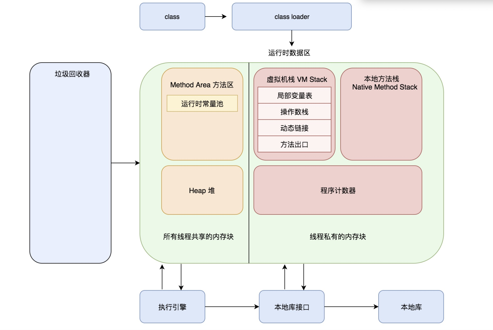
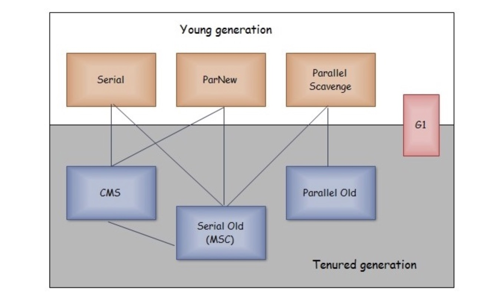

### JVM基本结构
.class -> classloader -> 运行时数据区 -> 执行引擎，本地库接口 -> 本地方法库
### JVM体系结构
虚拟机是物理机器的软件实现。java遵循write once run anywhere 理念，它运行在vm上，编译器将Java文件编译成.class文件，将
class文件输入到JVM中，加载并执行该类文件


运行时数据区 > 堆 方法区  栈 程序计数器 本地方法栈
 
### jvm是怎么工作的
- 类加载子系统 > 加载 链接 初始化

        1.加载
        这个组件负责加载类，BootStrap类加载器，Extension类加载器和Application类加载器
          1.1 BootStrap类加载器负责加载classpath下面的类，如果没有类将只加载rt.jar之歌类加载器优先级最高
          1.2 Extension类加载器负责加载扩展文件夹jre/lib中的类
          1.3 Application类加载负责加载应用级classpath和环境变量指向的路径下的类
        2.链接
          2.1 校验 字节码验证器将校验生成的字节码是否正确，如果校验失败，我们将得到校验错误信息。
          2.2 准备 对所有的静态变量，内存将被申请并分配默认值
          2.3 解析 所有的内存引用从方法区域被替换成的原始引用
        3.初始化  所有静态变量豆浆被分配值，静态代码将会被执行
- 运行时数据区

        1.java堆 堆的主要作用是存放程序创建过程中创建的对象实例，因为要存放的对象实例有可能会极多，因此也是需要虚拟机内存管理的一大块
        并且由于硬件条件有限所以需要不断回收已无用的实力对象，来腾出空间给新生成的实力对象，因此java的垃圾回收主要针对堆进行回收的，java
        堆很多时候也称为gc堆
            1.1 新生代
                在方法中new一个对象，就是新生代对象，方法执行完毕后就被回收
            1.2 老年代
                在新生代中经历了N次垃圾回收后仍然存活的对象就会被放到老年代中，而大对象直接进入老年代
                当Survivor空间不够时，需要依赖老年代进行分配担保，所以大对象直接进入老年代
            1.3 永久代--方法区
                当一个对象被创建时，它首先进入新生代，之后被转移到老年代中。
                年轻代 to from eden 1:1:8   
                老年代 tenured  
                永久代 perm
                -Xmx -Xms -XX:MaxPermSize  -XX:PermSize  -XX:NewSize -XX:MaxNewSize
        2.方法区 用于存储虚拟机加载的类信息，常量，静态变量即使编译器编译后的呆萌的等数据，线程共享
          Java1.7之前虚拟机把它当作永久代进行垃圾回收，JDK1.8之后取消了永久代，用了元数据区替代
        3.虚拟机栈 也是我们常说的栈，是java方法运行的内存结构，虚拟机会为每个java方法执行时创建一个栈帧，用于存储局部变量表，操作数栈，动态链接
        方法出口等信息。当方法执行完毕后，该栈帧会从虚拟机栈中出战。其中局部变量表高喊基本类型和对象引用
        4.本地方法栈 类似java方法的执行有虚拟机栈，本地方法的执行则对应本地方法栈。
        5.程序计数器 用于记录当前先后从那个正在执行的字节码指令位置。由于虚拟机的多线程是切换线程并分配cpu执行时间的方法实现的，不同线程的执行位置都
        需要记录下来，因此程序计数器是线程私有的
- 执行引擎

        1.解释器-解释器能更加快速地解释字节码，但是执行缓慢，解释器的缺点是当多次调用一个方法时每次都要重新解释
        2.JIT编译器-弥补解释器的不足，执行引擎使用解释器来转换字节码，当它发现重复的代码时，它将使用JIT编译器来编译
        整个字节码并转换为本地代码，本地代码将直接被重复的方法调用
        3.中间代码生成器，生成中间代码
        4.目标代码生成器，生成机器码或者本地代码
        5.分析器 一个特殊的组件负责查找热点代码
        6.垃圾回收期 回收并删除未引用的对象，可以通过system.gc来出发垃圾回收，但不能保证它执行jvm的垃圾回收被创建的对象
### 判断一个对象是否可回收
    
   程序计数器、虚拟机栈和本地方法栈这三个区域属于线程私有的，只存在于他的神谷明周期内，线程结束后也会消失，因此不需要对这三个
   区域进行垃圾回收，垃圾回收主要针对java堆和方法区进行
 - 引用计数法
   
   给对象添加一个引用计数器每当有引用他的地方计数器加1，当引用失效时候计数器减1，无法解决相互循环引用
 - 可达性分析算法
   
   通过GCRoots作为起始点进行搜索，能够达到的对象都是存活的，不可达的可被回收
   
   那些对象可以做为GC Roots对象
   1. 虚拟机栈中引用的对象
   2. 方法区中静态属性引用的对象
   3. 方法区中常量引用的对象
   4. 本地方法栈中引用的对象
 ### 引用类型
 - 强引用
    
    被强引用关联的对象不会被回收 new Object();
 - 弱引用
    
    被软引用关联的对象只有在内存不够的情况下才会被回收
    ```$xslt
        Object obj=new Object();
        SoftReference<Object> sf=new SoftReference<>(obj);
        obj=null;
    ```
 - 软引用
    
    被软引用关联的对象一定会被回收
    ```$xslt
        Object obj=new Object();
        WeakReference<Object> wf=new WeakReference<>(obj);
        obj=null;
    ```
 - 虚引用
    任何时候都能被回收

### 方法区的回收

在堆中每一次垃圾的收集一般可以回收70%-95%的空间，而永久代垃圾收集效率远低于此，永久代收集主要包括两个部分
废弃的常量和无用的类
### 垃圾收集算法
- 标记清除

首先标记出所有需要回收的对象，标记完成后统一回收所有标记的对象，效率问题效率不高 空间问题产生大量不连续的内存碎片
- 标记整理

标记过程和标记-清除算法一样，但后续不是直接清理对象，而是让所有存活的对象都向一端移动，然后直接清除边界以外的内存
- 复制

将内存划分为大小相等的两块，每次都使用其中的一块，当这一块内存用完了就将存活的对象复制到另一块上，然后再把使用过的内存进行
一次清理。
- 分代回收

新生代使用复制算法，老年代使用标记清除或者标记整理算法

### 垃圾收集器

- serial收集器

    翻译为串行，他是单线程收集器，简单高效，由于没有线程交互的开销，有较高的收集效率
    他是client默认的新生代收集器。
- ParNew(复制算法)

    是serial收集器的多线程版本
    是server模式下首选的新生代收集器，处理性能原因外，除了serial收集器，只有他能与cms收集器配合工作。
    默认开启的线程数量和cpu数量相同，可以使用-XX:ParallelGCThreads参数来设置线程数
- Parallel Scavenge

    是一个采用复制算法，并行的多线程收集器，适用于新生代。
    和ParNew的区别是，其他收集器关注于停顿时间，该收集器关注于吞吐量，可以高效率的利用cpu时间尽快的完成程序运算。
- servial Old
   
  是servial收集器的老年代版本，它同样是一个单线程收集器，使用标记整理算法

- Parallel Old
   
  是Parallel Scavenge的老年代版本，使用标记整理算法
 
- CMS（Concurrent Mark Sweep） 代表标记清除算法。有点并发收集低停顿。
    四个流程
    1. 初始标记：仅仅知识标记一下GC Roots能直接关联的对象，速度很快，需要停顿
    2. 并发标记：进行GC Roots追踪规程，他在整个回收过程中耗时最长，不需要停顿
    3. 重新标记：为了修正并发标记期间因用户程序继续运作而导致标记产生变动的那一部分对象的标记记录，需要停顿
    4. 并发清除：不需要停顿
- G1
  Oracle在jdk中将G1变成默认的收集器，代替CMS
  G1把堆划分为多个大小相等的独立区域，新生代和老年代不再需要物理隔离，引入了Region的概念，从而将一整块内存空间划分为多个
  校共建，使得诶个小空间可以单独进行垃圾回收，这种划分方法带来了很大的灵活性。使得可预测的停顿时间模型称为可能，通过记录
  每个region垃圾回收时间以及回收所获得的空间，并维护一个优先列表，每次根据允许的收集手贱，优先回收价值打得region
  每个region都有一个remembered set用来记录region对象的引用对象所在的region通过使用rememberedset在做可达性分吸的时候
  就可以避免全堆扫描。
  
      1.初始标记
      2.并发标记
      3.最终标记
        为了修正并发标记机器因用户程序继续运作产生的新垃圾。
      4.筛选回收
        首先对哥哥region中的回收价值和成本进行排序，根据用户所期望的GC停顿时间来执行回收激活。
### 内存回收与回收策略
- MinorGC FULL GC

        1. MinorGC 发生在新生代上，因为新生代对象存活时间很短，因此MinorGC会频繁执行，执行速度一般也比较快
        2. fullGC 发生在老年代上，老年代对象存活时间长，因此FullGC很少执行。执行速度比MinnorGC慢很多  
- 内存分配

        1.优先在eden上分配，大多数情况下，对象在新生代Eden区分配，当Eden区空间不够时发起Minor GC
        2.大对象直接进入老年代，大对象指的是连续内存空间的对象，最典型的是那种很长的字符串以及数组
        经常出现大对象会提前出发垃圾收集以获取足够的连续空间分配给大对象
        3.长期存活的对象进入老年代。为对象定义年龄计数器，对象在Eden出生并经过Minor GC依然存活，将转移到Survivor
        年龄就增加1岁，增加到一定年龄则移动到老年代
        4.动态对象年龄判定
        虚拟机并不是永远地要求对象的年龄必须达到MaxTenuringThreshold才能晋升到老年代，如果在survivor中相同年龄
        所有对象大小的综合大于surbibor空减的一般，则年龄大于或等于该年龄的对象可以直接进入老年代，无需等到MaxTenuringThreshold
        要求的年龄。
        5.空间分配担保
        在发生Minor GC之前，虚拟机先检查老年代最大可用连续的空间是否大于新生代对象总空间，如果条件成立，那么认为Minor GC是安全的
        如果不成立的话虚拟机会查看HandlePromotionFailure设置值是否允许担保失败，如果允许就会继续检查老年代最大可用连续空间是否大于
        历次晋升老年代对象的平均大小，如果大于则尝试进行一次MinorGC如果小于，或者不允许，那么就需要进行fullGC
- full GC条件

        1.调用Syatem.gc() 知识虚拟机建议执行fullGC 但是虚拟机不一定去执行
        2.老年代空间不足，为了避免大对象直接进入老年代，长期存活的对象进入老年代，引起FUllGC应当尽量不要创建
        大的对象和数组。除此之外可以用过可以用过-Xmn虚拟机参数调大新生代的大小，让对象尽量在新生代被回收掉。不进入老年代
        还可以通过设置-XX:MaxTenuingThreshold调大对象进入老年代的年龄，让对象在新生代多存活一段时间
        3.空间分配担保失败，使用复制算法的MinorgC需要老年代的内存空间做担保，如果担保失败就会执行一次FullGC
        4.永久代空间内存不足（JDK1.7）永久代中存放了一下class信息，常量，静态变量等数据当系统中要加载的类、反射的类和调用
        的方法较多时，永久代可能会被占满，在未配置为采用cms gc的情况下也会执行full gc如果经过full gc回收不了，那么虚拟机会
        抛出OOM
        5.Concurrent Mode Failure
        执行cms GC的过程中同时有对象放入老年代，而此时老年代空间不足，便会报Concurrent Mode Failure错误，触发Full GC
### 类加载机制

加载、验证、准备、解析、初始化、使用、卸载
- 类初始化时机

        1.主动引用
        虚拟机规范中并没有强制越是何时进行加载，但是规范严格规定了只有下列五种情况必须对类进行初始化、
          1.1
          遇到new getstatic putstatic invokestatic这四个字节码指令时，如果类没有进行过初始化，则必须先触发出初始化，最常见
          的生成这四条指令的场景是：使用new关键字实例化对象的时候，读取或设置一个类的静态字段，被final修饰、已在编译期把结果
          放入常量池的静态字段除外，的时候、调用一个类的静态方法的时候
          1.2
          使用java.lang.reflect包的方法对类进行反射调用的时候，如果类没有初始化，则需要先触发初始化
          1.3
          当初始化一个累的时候如果发现其父类还没有进行初始化，则需要先触发父类的初始化
          1.4
          当虚拟机启动时，用户需要指定一个要执行的主类，虚拟机会先初始化这个主类
          1.5
          当使用jdk1.7的动态语言支持时，如果一个java.lang.invoke.MethodHandle实例最后的解析结果为REF_getstatic、REF_putstatic
          REF_invokestatic的方法具柄，并且这个方法具柄所对应的类还没有进行过初始化，则需要先触发其初始化。
        2.被动引用
        以上五种场景中的行为对一个类进行主动引用，除此之外，所有引用类的方式都不会触发初始化，称为被动引用
          1.1
          通过子类引用父类的静态字段，不会导致子类初始化
          System.out.println(SubClass.value);
          1.2
          通过数组定义来引用类，不会触发类的初始化，该过程会对数组类进行初始化，数组类是一个由虚拟机自动生成的直接继承自Object类
          其中包含了数组的属性和方法
          SuperClass []sca =new SuperClass[10];
          1.3
          常量在编译阶段会存入调用类的常量池中，本质上并没有直接引用到定义常量的类，因此不会触发定义常量的类的初始化
          System.out.println(ConstClass.HELLOWORLD);
- 类加载过程
        
        1.加载 加载是类加载的一个阶段主要完成三件事
          1.1 通过一个类的全限定名来获取定义此类的二进制字节流
          1.2 将这个字节流所代表的静态存储结构转化为方法区运行时存储结构
          1.3 在内存中生成一个代表这个类的class对象作为方法区这个类的各种数据的访问入口
        2.验证 确保class文件的字节流中包含的信息符合当前虚拟机的要求，并且不会危害虚拟机自身的安全
          2.1 文件格式验证：验证字节流是否符合class文件格式的规范，并且能够被当前版本的虚拟机处理
          2.2 元数据验证 对字节码描述的信息进行语义分析，以确保其描述的信息符合java语言规范的要求 是否继承final类，非抽象类实现了所有的抽象方法
          2.3 字节码验证：通过数据流和控制流分析，确保程序语义是都合法符合逻辑 运行检查，栈数据类型和操作吗数据参数吻合，跳转指令指定到合理的位置
          2.4 符合引用验证：发生在虚拟机将符号引用转换为直接引用的时候，对类自身以外的信息进行匹配性校验 常量池中描述类是否存在，访问的方法或字段是都存在
        3.准备 
          准备阶段正式为类变量分配内存，并设置变量的初始值，这些变量使用的内存都将在方法区中进行分配。
          实例变量不会在这阶段分配内存，它将会在对象实例化时随着对象一起分配到堆中。类加载发生在实例化操作之前，类加载只进行一次，实例化可以进行多次
          初始值一般为0值，
          public static int value = 123
          对于 static final类型，在准备阶段就会覆值
          public static final int value = 123
        4.解析 解析阶段是虚拟机将常量池的符号引用转换为直接引用的过程
          4.1 类或接口的解析
          4.2 字段解析 
          4.3 类方法解析
          4.4 接口方法解析  
          什么是符合引用和直接引用？
          符号引用是一组符号来描述所引用的目标对象，符号可以是任何形式的字面量，只有使用时能无歧义的定位到目标即可，符号引用与虚拟机实现的内存布局无关
          引用的目标对象并不一定已经加载到内存中。
          直接引用 直接引用可以是直接指向目标对象的指针，相对偏移量或是一个能简介定位到目标的句柄，直接引用是与虚拟机内存布局实现相关的，同一个符号引用在不同
          虚拟机实力上翻译出来的直接引用一般不用，如果有了直接引用，那么引用的目标必定在内存中存在。
          符号引用就是字符串，这个字符串包含足够的信息，以供时机使用时可以找到相应的位置，比如说某个方法的符号引用
          如 java/io/PrintStream.println:(Ljava/lang/string;)V 里面有累的信息，方法名，方法参数等信息
          当第一次运行时，要根据字符串的内容，到该类的方法表中搜索这个方法，运行一次之后，符号引用会被替换成直接引用，下次就不用搜索了，
          直接引用就是偏移量，通过偏移量虚拟机可以直接在该类的内存区域中找到方法字节码的起始位置。
        5.初始化
           初始化接待你菜是真正执行类中定义的java代码，初始化节点即虚拟机执行类的构造器
           在准备阶段，类变量已经赋过一次吸用要求的初始值，在初始化节点，根据程序员通过程序制定的主观计划区初始化类变量和其他资源、
          5.1 是由编译器自动收集类中所有类变量的赋值动作和静态语句块中的语句合并产生的，编译器收集的顺序由语句在源文件中出现的顺序决定。
          特别注意的是，静态语句块只能访问到定义在它之前的类变量，定义在它之后的类变量只能赋值，不能访问
          public class Test{
            static {
                i=0; //编译通过
                System.out.println(i); //编译不通过
            }
            //
            static int i=1;
          }
### 类加载器
把类加载阶段通过一个类的全限定名来获取描述此类的二进制字节流 实现这个动作的代码模块称为类加载器
- 类与类加载器
两个类相等，只有被同一个类加载器加载的类才可能会相等。相同的字节码被不用的类加载器加载的类不相等
这里的相等，包括类的Class对象的equals方法、isAssignableFron方法 isInstance方法的返回结果为true也包括使用instaceof
关键字做对象关系判断结果为true
- 类加载器分类
启动类加载器 这个类加载器用c++实现，是虚拟机自身的一部分 负责加载/lib下类如rt.jar
扩展类加载器 这个类加载器由ExtClassLoader实现，负责将/lib/ext或者被java.ext.dir系统变量所制定路径中所有类库加载到内存中
应用程序类加载器 这个类是由AppClassLoader实现的，由于这个类加载器是ClassLoader中的getSystemClassLoader方法的返回值，因此一般称为系统
类加载器。负责加载用户类路径上所指定的类库，开发者可以直接使用这个类加载器
自定义类加载器           
### 创建一个对象的过程
Student s=new Student();
1. 加载Student.class文件进内存
2. 在栈内存为s开辟空间
3. 在堆内存为student对象开辟空间
4. 对Student对象的成员变量进行默认初始化
5. 对成员变量进行显示初始化
6. 通过构造方法对Student对象的成员变量赋值
7. Student对象初始化完毕，把对象地址赋值给s变量

### java虚拟机工具
jps、jstat、jinfo 、jmap、jstack

- jps 可以查看虚拟机正在运行的进程 

        yangyuanliangdeMacBook-Pro%  jps
            19792 Launcher
            354 
            23205 Jps
            21734 Launcher
- jstat这个命令用于监视虚拟机各种运行状态信息，它可以显示本地或者远程虚拟机进程中的类加载，内存、垃圾收集JIT编译等运行数据
        
        yangyuanliangdeMacBook-Pro% jstat -gcutil 19792
            S0     S1     E      O      M     CCS    YGC     YGCT    FGC    FGCT     GCT   
            0.00  52.74  67.33   0.08  96.63  93.90      1    0.009     0    0.000    0.009
- jinfo 这个命令可以实时的查看和调整虚拟机参数

        yangyuanliangdeMacBook-Pro% jinfo -flag NewSize 21734
            -XX:NewSize=89128960
- jmap 用于生成堆内存的快照，一般是heapdump或者dump文件，如果不适用jmap命令可以使用-XX:+HeapDumpOnOutOfMemoryError
  当虚拟机发生内存溢出的时候可以产生快照，使用kill -3 pid也会 
- jhat 分析jmap dump出来的文件
   jhat test.bin 会在本地启动一个web服务，端口是7000
- jstack  pid
    用于查看虚拟机当前时候的线程快站，可以定位线程出现长时间停顿的原因，入线程见死锁、死循环、请求外部资源导致长时间等待都是导致
    线程长时间停顿的原因、

### 如何确认自己的JDK使用的哪个垃圾收集器？
- 在可以用jvm参数,打印自己的jdk版本和收集器信息
```
   -XX:+PrintCommandLineFlags  -version
```
- 测试代码-指定参数启动
```
/**
 * @author yangyuanliang
 * @version 1.9
 * @date 2022/4/25 20:34
 */
public class JvmGC {
	public static void main(String[] args) {
		System.out.println("test");
	}
}
```
- 输出信息
```
-XX:InitialHeapSize=134217728 -XX:MaxHeapSize=2147483648 -XX:+PrintCommandLineFlags -XX:+UseCompressedClassPointers -XX:+UseCompressedOops 
-XX:+UseParallelGC  我的是java8版本，该参数代表使用的Paralle垃圾收集器
java version "1.8.0_191"
Java(TM) SE Runtime Environment (build 1.8.0_191-b12)
Java HotSpot(TM) 64-Bit Server VM (build 25.191-b12, mixed mode)
```
### Paralle垃圾收集器介绍
- 新生代使用 Parallel Scavenge收集器
  使用的算法是基于标记-复制算法实现。收集器的目标是达到一个可控制的吞吐量，如何计算：吞吐量=用户代码运行时间/（代码运行时间+垃圾收集时间），重点关注一个参数吧 -XX:UserAdaptiveSizePolicy 这个参数激活后，不需要人工的指定新生代大小（-Xmn）、Eden与Surivivor区的比例，晋升老年代对象大小等参数了，虚拟机会根据当前系统运行情况收集性能监控信息动态调整这些参数以提供最合适的停顿时间合或最大的吞吐量。
- 老年带使用的是Parallel Old收集器
  是Parallel Scavenge的老年代版本，基于标记-整理算法实现，支持多线程并行收集。他的出现缓解了Parallel Scavenge的尴尬处境，因为Parallel Scavenge和别的优秀的老年代收集器不搭。出现后他俩搭配，才让吞吐量优先的收集器名副其实。

### 模拟过程

- 加参数定义最大堆空间和最小堆空间
```
	-Xms20m -Xmx20m 
```
- 加参数在堆溢出dump出当前的堆快照
```
-XX:+HeapDumpOnOutOfMemoryError
```
### 上代码
```java
import java.util.ArrayList;
import java.util.List;

/**
 * @author yangyuanliang
 * @version 1.9
 * @date 2022/4/24 21:49
 */
public class HeapOOM {
	static class OOMObject{
	}

	public static void main(String[] args) {
		List<HeapOOM> ooms = new ArrayList<>();
		while(true) {
			ooms.add(new HeapOOM());
		}
	}
}
```
### 运行结果
```
/Library/Java/JavaVirtualMachines/jdk1.8.0_191.jdk/Contents/Home/bin/java -Xms20m -Xmx20m -XX:+HeapDumpOnOutOfMemoryError -javaagent:/Applications/IntelliJ IDEA.app/Contents/lib/idea_rt.jar=53845:/Applications/IntelliJ IDEA.app/Contents/bin -Dfile.encoding=UTF-8 -classpath /Library/Java/JavaVirtualMachines/jdk1.8.0_191.jdk/Contents/Home/jre/lib/charsets.jar:/Library/Java/JavaVirtualMachines/jdk1.8.0_191.jdk/Contents/Home/jre/lib/deploy.jar:/Library/Java/JavaVirtualMachines/jdk1.8.0_191.jdk/Contents/Home/jre/lib/ext/cldrdata.jar:/Library/Java/JavaVirtualMachines/jdk1.8.0_191.jdk/Contents/Home/jre/lib/ext/dnsns.jar:/Library/Java/JavaVirtualMachines/jdk1.8.0_191.jdk/Contents/Home/jre/lib/ext/jaccess.jar:/Library/Java/JavaVirtualMachines/jdk1.8.0_191.jdk/Contents/Home/jre/lib/ext/jfxrt.jar:/Library/Java/JavaVirtualMachines/jdk1.8.0_191.jdk/Contents/Home/jre/lib/ext/localedata.jar:/Library/Java/JavaVirtualMachines/jdk1.8.0_191.jdk/Contents/Home/jre/lib/ext/nashorn.jar:/Library/Java/JavaVirtualMachines/jdk1.8.0_191.jdk/Contents/Home/jre/lib/ext/sunec.jar:/Library/Java/JavaVirtualMachines/jdk1.8.0_191.jdk/Contents/Home/jre/lib/ext/sunjce_provider.jar:/Library/Java/JavaVirtualMachines/jdk1.8.0_191.jdk/Contents/Home/jre/lib/ext/sunpkcs11.jar:/Library/Java/JavaVirtualMachines/jdk1.8.0_191.jdk/Contents/Home/jre/lib/ext/zipfs.jar:/Library/Java/JavaVirtualMachines/jdk1.8.0_191.jdk/Contents/Home/jre/lib/javaws.jar:/Library/Java/JavaVirtualMachines/jdk1.8.0_191.jdk/Contents/Home/jre/lib/jce.jar:/Library/Java/JavaVirtualMachines/jdk1.8.0_191.jdk/Contents/Home/jre/lib/jfr.jar:/Library/Java/JavaVirtualMachines/jdk1.8.0_191.jdk/Contents/Home/jre/lib/jfxswt.jar:/Library/Java/JavaVirtualMachines/jdk1.8.0_191.jdk/Contents/Home/jre/lib/jsse.jar:/Library/Java/JavaVirtualMachines/jdk1.8.0_191.jdk/Contents/Home/jre/lib/management-agent.jar:/Library/Java/JavaVirtualMachines/jdk1.8.0_191.jdk/Contents/Home/jre/lib/plugin.jar:/Library/Java/JavaVirtualMachines/jdk1.8.0_191.jdk/Contents/Home/jre/lib/resources.jar:/Library/Java/JavaVirtualMachines/jdk1.8.0_191.jdk/Contents/Home/jre/lib/rt.jar:/Library/Java/JavaVirtualMachines/jdk1.8.0_191.jdk/Contents/Home/lib/ant-javafx.jar:/Library/Java/JavaVirtualMachines/jdk1.8.0_191.jdk/Contents/Home/lib/dt.jar:/Library/Java/JavaVirtualMachines/jdk1.8.0_191.jdk/Contents/Home/lib/javafx-mx.jar:/Library/Java/JavaVirtualMachines/jdk1.8.0_191.jdk/Contents/Home/lib/jconsole.jar:/Library/Java/JavaVirtualMachines/jdk1.8.0_191.jdk/Contents/Home/lib/packager.jar:/Library/Java/JavaVirtualMachines/jdk1.8.0_191.jdk/Contents/Home/lib/sa-jdi.jar:/Library/Java/JavaVirtualMachines/jdk1.8.0_191.jdk/Contents/Home/lib/tools.jar:/Users/liang/ruijie/jvm-test/out/production/jvm-test HeapOOM
java.lang.OutOfMemoryError: Java heap space
Dumping heap to java_pid76264.hprof ...
Heap dump file created [27766960 bytes in 0.100 secs]
Exception in thread "main" java.lang.OutOfMemoryError: Java heap space
	at java.util.Arrays.copyOf(Arrays.java:3210)
	at java.util.Arrays.copyOf(Arrays.java:3181)
	at java.util.ArrayList.grow(ArrayList.java:265)
	at java.util.ArrayList.ensureExplicitCapacity(ArrayList.java:239)
	at java.util.ArrayList.ensureCapacityInternal(ArrayList.java:231)
	at java.util.ArrayList.add(ArrayList.java:462)
	at HeapOOM.main(HeapOOM.java:17)

Process finished with exit code 1
```
### 分析过程
Java堆内存的OutOfMemoryError异常是实际应用中最常见的内存溢出异常情况。常规的处理方法，通过内存映像分析工具对Dump出来的堆快照进行分析。确认是内存泄露还是内存溢出（这个是基于导致OOM的对象是否是必要的来决定的）。
### 内存泄露
如果是内存泄漏，可进一步借助攻击分析查看对象到GC Roots的引用链，找到泄漏对象通过怎样的引用路径，与那些GC Roots相关联，才导致垃圾收集器无法回收他们，根据对象的类型信息以及他到GCRoots引用链的信息，一般可以准确的定位到这些对象创建的位置，进而找出内存泄漏代码的位置


### 内存溢出
内存溢出的话，那就应该检查Java虚拟机的堆参数，通过- Xmx与-Xms设置，与机器内存对比，看看是否还有空间可调整。在从代码简称是否存在某些对象生命周期过长，持有状态时间过长，存储结构设计不合理的情况，尽量减少程序运行期的内存消耗。

