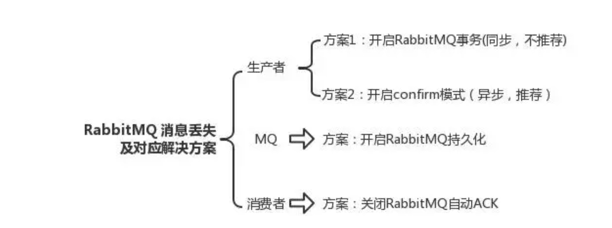

User Guide
RocketMQ是一款分布式消息中间件，最初是由阿里巴巴消息中间件团队研发并大规模应用于生产系统，满足线上海量消息堆积的需求， 
在2016年底捐赠给Apache开源基金会成为孵化项目，经过不到一年时间正式成为了Apache顶级项目；早期阿里曾经基于ActiveMQ研发消息系统，
 随着业务消息的规模增大，瓶颈逐渐显现，后来也考虑过Kafka，但因为在低延迟和高可靠性方面没有选择，
 最后才自主研发了RocketMQ， 各方面的性能都比目前已有的消息队列要好，RocketMQ和Kafka在概念和原理上都非常相似，
 所以也经常被拿来对比；RocketMQ默认采用长轮询的拉模式， 单机支持千万级别的消息堆积，可以非常好的应用在海量消息系统中。
NameServer可以部署多个，相互之间独立，其他角色同时向多个NameServer机器上报状态信息，从而达到热备份的目的。 NameServer本身是无状态的，
也就是说NameServer中的Broker、Topic等状态信息不会持久存储，都是由各个角色定时上报并 存储到内存中的(NameServer支持配置参数的持久化，一般用不到)。
为何不用ZooKeeper？ZooKeeper的功能很强大，包括自动Master选举等，RocketMQ的架构设计决定了它不需要进行Master选举， 
用不到这些复杂的功能，只需要一个轻量级的元数据服务器就足够了。值得注意的是，NameServer并没有提供类似Zookeeper的watcher机制，
 而是采用了每30s心跳机制。
心跳机制
单个Broker跟所有Namesrv保持心跳请求，心跳间隔为30秒，心跳请求中包括当前Broker所有的Topic信息。
Namesrv会反查Broer的心跳信息， 如果某个Broker在2分钟之内都没有心跳，则认为该Broker下线，
调整Topic跟Broker的对应关系。但此时Namesrv不会主动通知Producer、Consumer有Broker宕机。
Consumer跟Broker是长连接，会每隔30秒发心跳信息到Broker。Broker端每10秒检查一次当前存活的Consumer，若发现某个Consumer 2分钟内没有心跳， 就断开与该Consumer的连接，并且向该消费组的其他实例发送通知，触发该消费者集群的负载均衡(rebalance)。
生产者每30秒从Namesrv获取Topic跟Broker的映射关系，更新到本地内存中。再跟Topic涉及的所有Broker建立长连接，每隔30秒发一次心跳。 在Broker端也会每10秒扫描一次当前注册的Producer，如果发现某个Producer超过2分钟都没有发心跳，则断开连接。
Namesrv压力不会太大，平时主要开销是在维持心跳和提供Topic-Broker的关系数据。但有一点需要注意，Broker向Namesrv发心跳时， 会带上当前自己所负责的所有Topic信息，如果Topic个数太多（万级别），会导致一次心跳中，就Topic的数据就几十M，网络情况差的话， 网络传输失败，心跳失败，导致Namesrv误认为Broker心跳失败。
每个主题可设置队列个数，自动创建主题时默认4个，需要顺序消费的消息发往同一队列，比如同一订单号相关的几条需要顺序消费的消息发往同一队列， 顺序消费的特点的是，不会有两个消费者共同消费任一队列，且当消费者数量小于队列数时，消费者会消费多个队列。至于消息重复，在消 费端处理。RocketMQ 4.3+支持事务消息，可用于分布式事务场景(最终一致性)。
关于queueNums:
客户端自动创建，Math.min算法决定最多只会创建8个(BrokerConfig)队列，若要超过8个，可通过控制台创建/修改，Topic配置保存在store/config/topics.json
消费负载均衡的最小粒度是队列，Consumer的数量应不大于队列数
读写队列数(writeQueueNums/readQueueNums)是RocketMQ特有的概念，可通过console修改。当readQueueNums不等于writeQueueNums时，会有什么影响呢？
topicRouteData = this.mQClientAPIImpl.getDefaultTopicRouteInfoFromNameServer(defaultMQProducer.getCreateTopicKey(), 1000 * 3);
    if (topicRouteData != null) {
        for (QueueData data : topicRouteData.getQueueDatas()) {
            int queueNums = Math.min(defaultMQProducer.getDefaultTopicQueueNums(), data.getReadQueueNums());
            data.setReadQueueNums(queueNums);
            data.setWriteQueueNums(queueNums);
        }
    }
Broker上存Topic信息，Topic由多个队列组成，队列会平均分散在多个Broker上。Producer的发送机制保证消息尽量平均分布到 所有队列中，最终效果就是所有消息都平均落在每个Broker上。
RocketMQ的消息的存储是由ConsumeQueue和CommitLog配合来完成的，ConsumeQueue中只存储很少的数据，消息主体都是通过CommitLog来进行读写。 如果某个消息只在CommitLog中有数据，而ConsumeQueue中没有，则消费者无法消费，RocketMQ的事务消息实现就利用了这一点。
CommitLog：是消息主体以及元数据的存储主体，对CommitLog建立一个ConsumeQueue，每个ConsumeQueue对应一个（概念模型中的）MessageQueue，所以只要有 CommitLog在，ConsumeQueue即使数据丢失，仍然可以恢复出来。
ConsumeQueue：是一个消息的逻辑队列，存储了这个Queue在CommitLog中的起始offset，log大小和MessageTag的hashCode。每个Topic下的每个Queue都有一个对应的 ConsumeQueue文件，例如Topic中有三个队列，每个队列中的消息索引都会有一个编号，编号从0开始，往上递增。并由此一个位点offset的概念，有了这个概念，就可以对 Consumer端的消费情况进行队列定义。
RocketMQ的高性能在于顺序写盘(CommitLog)、零拷贝和跳跃读(尽量命中PageCache)，高可靠性在于刷盘和Master/Slave，另外NameServer 全部挂掉不影响已经运行的Broker,Producer,Consumer。
发送消息负载均衡，且发送消息线程安全(可满足多个实例死循环发消息)，集群消费模式下消费者端负载均衡，这些特性加上上述的高性能读写， 共同造就了RocketMQ的高并发读写能力。
刷盘和主从同步均为异步(默认)时，broker进程挂掉(例如重启)，消息依然不会丢失，因为broker shutdown时会执行persist。 当物理机器宕机时，才有消息丢失的风险。另外，master挂掉后，消费者从slave消费消息，但slave不能写消息。
RocketMQ具有很好动态伸缩能力(非顺序消息)，伸缩性体现在Topic和Broker两个维度。
Topic维度：假如一个Topic的消息量特别大，但集群水位压力还是很低，就可以扩大该Topic的队列数，Topic的队列数跟发送、消费速度成正比。
Broker维度：如果集群水位很高了，需要扩容，直接加机器部署Broker就可以。Broker起来后向Namesrv注册，Producer、Consumer通过Namesrv 发现新Broker，立即跟该Broker直连，收发消息。
Producer: 失败默认重试2次；sync/async；ProducerGroup，在事务消息机制中，如果发送消息的producer在还未commit/rollback前挂掉了，broker会在一段时间后回查ProducerGroup里的其他实例，确认消息应该commit/rollback
Consumer: DefaultPushConsumer/DefaultPullConsumer，push也是用pull实现的，采用的是长轮询方式；CLUSTERING模式下，一条消息只会被ConsumerGroup里的一个实例消费，但可以被多个不同的ConsumerGroup消费，BROADCASTING模式下，一条消息会被ConsumerGroup里的所有实例消费。
DefaultPushConsumer: Broker收到新消息请求后，如果队列里没有新消息，并不急于返回，通过一个循环不断查看状态，每次waitForRunning一段时间(5s)，然后在check。当一直没有新消息，第三次check时，等待时间超过suspendMaxTimeMills(15s)，就返回空结果。在等待的过程中，Broker收到了新的消息后会直接调用notifyMessageArriving返回请求结果。“长轮询”的核心是，Broker端Hold住(挂起)客户端客户端过来的请求一小段时间，在这个时间内有新消息到达，就利用现有的连接立刻返回消息给Consumer。“长轮询”的主动权还是掌握在Consumer手中，Broker即使有大量消息积压，也不会主动推送给Consumer。长轮询方式的局限性，是在Hold住Consumer请求的时候需要占用资源，它适合用在消息队列这种客户端连接数可控的场景中。
DefaultPullConsumer: 需要用户自己处理遍历MessageQueue、保存Offset，所以PullConsumer有更多的自主性和灵活性。
对于集群模式的非顺序消息，消费失败默认重试16次，延迟等级为3~18。(messageDelayLevel = "1s 5s 10s 30s 1m 2m 3m 4m 5m 6m 7m 8m 9m 10m 20m 30m 1h 2h")
MQClientInstance是客户端各种类型的Consumer和Producer的底层类，由它与NameServer和Broker打交道。如果创建Consumer或Producer 类型的时候不手动指定instanceName，进程中只会有一个MQClientInstance对象，即当一个Java程序需要连接多个MQ集群时，必须手动指定不同的instanceName。需要一提的是，当消费者(不同jvm实例)都在同一台物理机上时，若指定instanceName，消费负载均衡将失效(每个实例都将消费所有消息)。另外，在一个jvm里模拟集群消费时，必须指定不同的instanceName，否则启动时会提示ConsumerGroup已存在。


### 生产者消息丢失
生产者将数据发送到 RabbitMQ 的时候，可能数据就在半路给搞丢了，因为网络问题啥的，都有可能。
此时可以选择用 RabbitMQ 提供的事务功能，就是生产者发送数据之前开启 RabbitMQ 事务channel.txSelect，然后发送消息，
如果消息没有成功被 RabbitMQ 接收到，那么生产者会收到异常报错，此时就可以回滚事务channel.txRollback，
然后重试发送消息；如果收到了消息，那么可以提交事务channel.txCommit。
```
// 开启事务
channel.txSelecttry {
// 这里发送消息
} catch (Exception e) {
channel.txRollback

// 这里再次重发这条消息

}
// 提交事务

channel.txCommit
```


但是问题是，RabbitMQ 事务机制（同步）一搞，基本上吞吐量会下来，因为太耗性能。
所以一般来说，如果你要确保说写 RabbitMQ 的消息别丢，可以开启 confirm 模式，
在生产者那里设置开启 confirm 模式之后，你每次写的消息都会分配一个唯一的 id，然后如果写入了 RabbitMQ 中，RabbitMQ 会给你回传一个 ack 消息，告诉你说这个消息 ok 了。如果 RabbitMQ 没能处理这个消息，
会回调你的一个 nack 接口，告诉你这个消息接收失败，你可以重试。而且你可以结合这个机制自己在内存里维护每个消息 id 的状态，
如果超过一定时间还没接收到这个消息的回调，那么你可以重发。
事务机制和 confirm 机制最大的不同在于，事务机制是同步的，
你提交一个事务之后会阻塞在那儿，但是 confirm 机制是异步的，你发送个消息之后就可以发送下一个消息，
然后那个消息 RabbitMQ 接收了之后会异步回调你的一个接口通知你这个消息接收到了。
所以一般在生产者这块避免数据丢失，都是用 confirm 机制的。


### mq消息丢失
rabbitMQ 弄丢了数据

就是 RabbitMQ 自己弄丢了数据，这个你必须开启 RabbitMQ 的持久化，就是消息写入之后会持久化到磁盘，哪怕是 RabbitMQ 自己挂了，恢复之后会自动读取之前存储的数据，一般数据不会丢。除非极其罕见的是，RabbitMQ 还没持久化，自己就挂了，可能导致少量数据丢失，但是这个概率较小。

设置持久化有两个步骤：

创建 queue 的时候将其设置为持久化
这样就可以保证 RabbitMQ 持久化 queue 的元数据，但是它是不会持久化 queue 里的数据的。
第二个是发送消息的时候将消息的 deliveryMode 设置为 2
就是将消息设置为持久化的，此时 RabbitMQ 就会将消息持久化到磁盘上去。
必须要同时设置这两个持久化才行，RabbitMQ 哪怕是挂了，再次重启，也会从磁盘上重启恢复 queue，恢复这个 queue 里的数据。

注意，哪怕是你给 RabbitMQ 开启了持久化机制，也有一种可能，就是这个消息写到了 RabbitMQ 中，但是还没来得及持久化到磁盘上，结果不巧，此时 RabbitMQ 挂了，就会导致内存里的一点点数据丢失。

所以，持久化可以跟生产者那边的 confirm 机制配合起来，只有消息被持久化到磁盘之后，才会通知生产者 ack 了，所以哪怕是在持久化到磁盘之前，RabbitMQ 挂了，数据丢了，生产者收不到 ack，你也是可以自己重发的。

### 消费端消息丢失
消费端弄丢了数据

RabbitMQ 如果丢失了数据，主要是因为你消费的时候，刚消费到，还没处理，结果进程挂了，比如重启了，那么就尴尬了，RabbitMQ 认为你都消费了，这数据就丢了。

这个时候得用 RabbitMQ 提供的 ack 机制，简单来说，就是你必须关闭 RabbitMQ 的自动 ack，可以通过一个 api 来调用就行，然后每次你自己代码里确保处理完的时候，再在程序里 ack 一把。这样的话，如果你还没处理完，不就没有 ack了？那 RabbitMQ 就认为你还没处理完，这个时候 RabbitMQ 会把这个消费分配给别的 consumer 去处理，消息是不会丢的。


### 解决重复消费的方案(保证幂等性)
    
比如你拿个数据要写库，你先根据主键查一下，如果这数据都有了，你就别插入了，update就行。对了，ES的插入接口是不是就采用了插入并更新的策略？发现相同的数据就直接更新他。

如果是写 Redis，那没问题，反正每次都是set，天然幂等性。

比如你不是上面两个场景，那做的稍微复杂一点，你需要让生产者发送每条数据的时候，里面加一个全局唯一的 id，类似订单 id 之类的东西，然后你这里消费到了之后，先根据这个 id 去 Redis 里查一下，之前消费过吗？如果没有消费过，你就处理，然后这个 id 写 进Redis。如果消费过了，那你就别处理了，保证别重复处理相同的消息即可。

比如基于数据库的唯一键来保证重复数据不会重复插入多条。因为有唯一键约束了，重复数据插入只会报错，不会导致数据库中出现脏数据。（类似于第一条，可以通过修改SQL，转成插入或更新的策略） 作者：浩说编程 https://www.bilibili.com/read/cv12611735 出处：bilibili

### 如何保证消息队列的高可用？

可以考虑镜像模式部署消息队列

    RabbitMQ 是基于主从做高可用性的，Rabbitmq有三种模式：单机模式、普通集群模式、镜像集群模式。

    单机模式一般在生产环境中很少用，普通集群模式只是提高了系统的吞吐量，让集群中多个节点来服务某个 Queue 的读写操作。

    那么真正实现 RabbitMQ 高可用的是镜像集群模式。

    镜像集群模式跟普通集群模式不一样的是，创建的 Queue，无论元数据还是Queue 里的消息都会存在于多个实例上，然后每次你写消息到 Queue 的时候，都会自动和多个实例的 Queue 进行消息同步。

    这样设计，好处在于：任何一个机器宕机不影响其他机器的使用。

    坏处在于：1. 性能开销太大：消息同步所有机器，导致网络带宽压力和消耗很重；2. 扩展性差：如果某个 Queue 负载很重，即便加机器，新增的机器也包含了这个 Queue 的所有数据，并没有办法线性扩展你的 Queue。 作者：浩说编程 https://www.bilibili.com/read/cv12611735 出处：bilibili