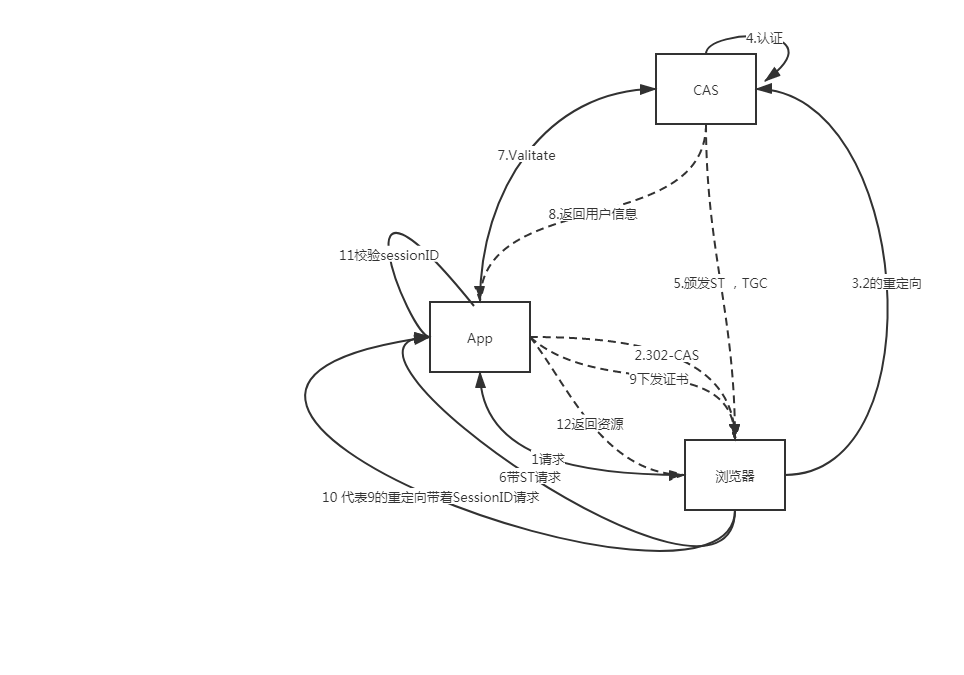

#### CAS学习
    CAS
    Central Authentication Service
    中心认证服务是web端一个单点登录/单点登出的协议
    它允许一个用户只登录一次到CAS服务应用就能拥有多个应用的访问权限
        
	1定义
	client指的是最终使用者或者web浏览器
	CAS client 指的是一种web应用程序集成并通过CAS协议和CAS服务器交互的软件组件 
	Server 指的是中心认证服务的服务器
	Service 指的是想要拿到授权的客户端
	Back-end service 指的是一个师徒代表一个客户端应用服务，也常常叫目标服务
	SSO 单点登录
	SLO 单点登出
	2.URI
	/login  					认证请求者/接受者
	有两种行为，作为一个认证的请求者并且作为一个接受者，返回一个凭据根据他是请求者海事接受者。
	
	参数 service renew gateway method
	service
	客户端试图访问的应用程序的标识符。在几乎所有情况下，这将是应用程序的URL。作为一个HTTP请求参数，这个URL值必须按照RFC 3986[4]第2.2节的描述进行URL编码。如果未指定服务且单个登录会话尚不存在，
    则CA应向用户请求凭据以启动单个登录会话。如果未指定服务且已存在单一登录会话，则CAS应显示一条消息，通知客户端它已登录。
	renew
	如果设置了此参数，将绕过单点登录。在这种情况下，无论是否存在与CAS的单一登录会话，CAS都将要求客户端提供凭据。此参数与网关参数不兼容。重定向到/login URI的服务和发布到/login URI的登录表单视图不应同时设置续订和网关请求参数。如果两者都已设置，则行为未定义。如果设置了renew，建议CAS实现忽略网关参数。建议当renew参数设置为“true”时。
	gateway
	如果设置了此参数，CAS将不会要求客户端提供凭据。如果客户端与CAS具有预先存在的单点登录会话，或者如果可以通过非交互方式（即信任身份验证）建立单点登录会话，则CAS可以将客户端重定向到服务参数指定的URL，并附加有效的服务票证。（CA还可以插入一个咨询页，通知客户端已进行了CA身份验证。）如果客户端没有与CA的单一登录会话，并且无法建立非交互式身份验证，CAS必须将客户机重定向到由服务参数指定的URL，而URL后面没有“ticket”参数。如果未指定服务参数并且设置了网关，则未定义CAS的行为。在这种情况下，建议CAS请求凭据，就像没有指定任何参数一样。此参数与renew参数不兼容。如果两者都已设置，则行为未定义。建议在设置网关参数时，将其值设置为“true”。
	
	method 
	发送响应时要使用的方法。虽然本机HTTP重定向（GET）可以用作默认方法，但需要POST响应的应用程序可以使用此参数指示方法类型。还可以指定头方法来指示CAS最终响应，例如service和tickets应该以HTTP响应头的形式返回。由CAS服务器实现决定是否支持POST或HEADER响应。
	
	TGT
    是cas为用户签发的登录票据
    拥有TGT，用户就可以证明自己在cas成功登录过
    TGT封装了Cookie值以及cookie对应的用户信息。用户在cas认证
    成功后，cas生成cookie叫TGC，同时生成一个TGT对象，放入自己的缓存
    TGT对象的ID就是cookie的值，当HTTP再次请求到来时候，如果传过来的
    有cas生成的cookie则cas以此cookie值查询有没有TGT，如果有的画，则说明
    用户之前登录过，没有则需要重新登录
    
    TGC
    存放用户身份凭证的cookie，在浏览器和Cas间通讯时使用，并且只能给予安全通道
    传输，是CASserver用来明确用户身份的凭证
    
    ST
    ST是CAS为用户签发的访问某一service的票据，用户访问service时候，service没有发现用户
    没有ST则要用户去cas获取st用户向cas发出获取st的请求，如果用户的请求中包含cookie则cas会
    以此cookie值为key查询缓存中有无TGT，如果存在TGT则用次TGT签发一个ST返给用户
    用户凭借着st去访问service，service拿st去cas验证，验证通过后允许访问资源。
	
	
	示例
	简单登录
	https://cas.example.org/cas/login?service=http%3A%2F%2Fwww.example.org%2Fservice
	不需要密码登录
	https://cas.example.org/cas/login?service=http%3A%2F%2Fwww.example.org%2Fservice&gateway=true
	需要密码登录
	https://cas.example.org/cas/login?service=http%3A%2F%2Fwww.example.org%2Fservice&renew=true
	OOST代替重定向
	https://cas.example.org/cas/login?method=POST&service=http%3A%2F%2Fwww.example.org%2Fservice
	/logout                     销毁CAS session
	/validate					服务的凭证校验
	/serviceValidate			服务凭证校验，2.0
	/proxyValidate				代理服务凭证校验2.0
	/proxy						代理服务
	/p3/serviceValidate			俯卧校验3.0
	/p3/proxyValidate			代理服务校验3.0
	
	
